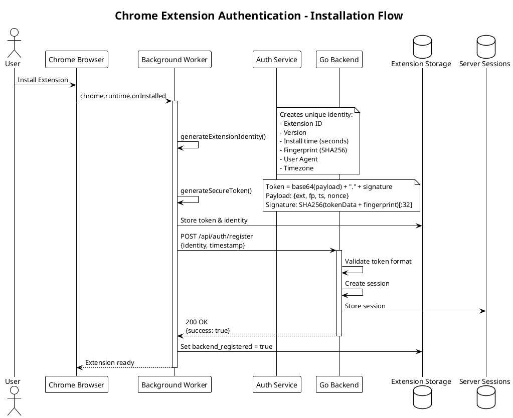
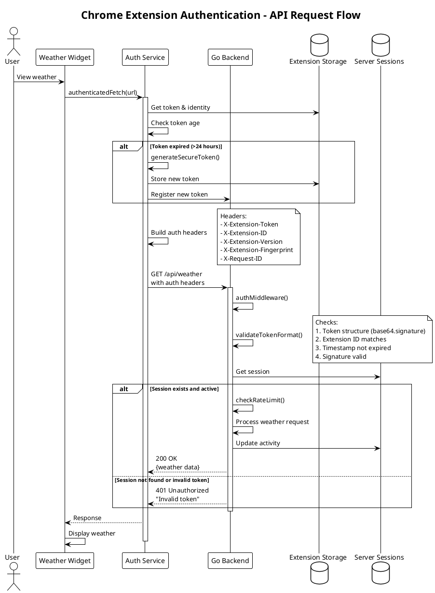
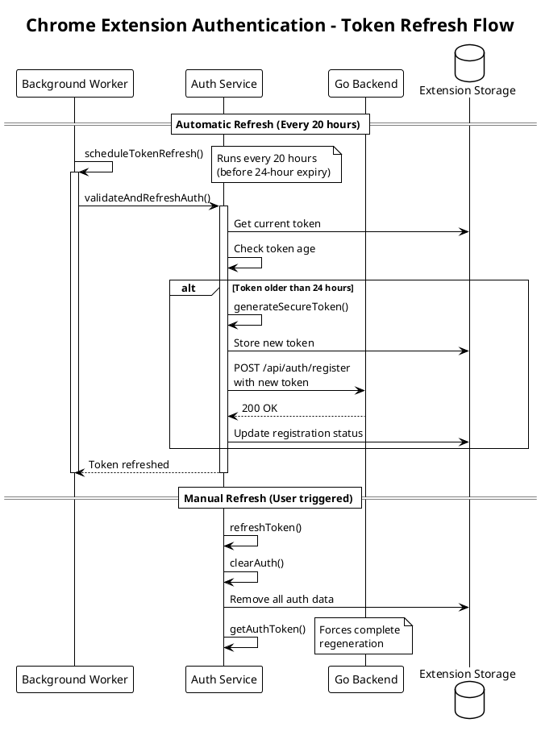

# Chrome Extension Authentication System

## Overview
This document describes the token-based authentication system implemented for the Chrome Home Extension to secure API access to the weather service backend.

## Architecture Components

### Frontend (Chrome Extension)
- **Background Service Worker** (`background.ts`): Handles extension lifecycle events and token generation
- **Auth Service** (`services/auth.ts`): Manages authentication tokens and authenticated API requests
- **Weather Widget** (`GoogleWeatherWidget.jsx`): Makes authenticated API calls

### Backend (Go Weather Service)
- **Auth Middleware** (`auth.go`): Validates tokens and manages sessions
- **Weather API** (`main.go`): Protected endpoints requiring authentication

## Authentication Flow

### 1. Extension Installation/Update Flow



### 2. API Request Flow



### 3. Token Refresh Flow



## Security Features

### Token Structure
```json
{
  "ext": "extension-id",           // Chrome extension ID
  "fp": "fingerprint-hash",        // SHA256 hash of identity
  "ts": 1754836537,               // Unix timestamp (seconds)
  "nonce": "unique-random-id"      // UUID for replay protection
}
```

### Token Generation
```typescript
// 1. Create payload
const payload = {
  ext: extensionId,
  fp: fingerprint,
  ts: Math.floor(Date.now() / 1000),  // IMPORTANT: Use seconds, not milliseconds
  nonce: uuid()
}

// 2. Encode payload
const tokenData = btoa(JSON.stringify(payload))

// 3. Generate signature
const signature = SHA256(tokenData + fingerprint).substring(0, 32)

// 4. Combine
const token = `${tokenData}.${signature}`
```

### Security Validations

1. **Token Format Validation**
   - Must be `base64payload.signature` format
   - Payload must be valid JSON
   - All required fields must be present

2. **Signature Verification**
   ```go
   expectedSig := SHA256(tokenData + fingerprint)[:32]
   valid := (providedSig == expectedSig)
   ```

3. **Timestamp Validation**
   - Token must be less than 24 hours old
   - Timestamp must be in seconds (not milliseconds)

4. **Session Management**
   - Extension must register before making API calls
   - Sessions track: identity, last activity, request count
   - Inactive sessions cleaned up after 7 days

5. **Rate Limiting**
   - 120 requests per minute per extension
   - Prevents abuse and DDoS attacks

## Common Issues and Solutions

### Issue 1: 401 Unauthorized - "Invalid token"

**Cause**: Token signature mismatch

**Solution**: 
- Ensure using `generateStringHash()` for signatures, not `generateFingerprint()`
- `generateFingerprint()` is for objects and adds JSON.stringify
- `generateStringHash()` directly hashes the string

### Issue 2: 401 Unauthorized - "Extension not registered"

**Cause**: Extension hasn't called registration endpoint

**Solution**:
- Background worker must call `/api/auth/register` on install
- Check Chrome DevTools > Application > Storage for `backend_registered`

### Issue 3: Token has wrong timestamp format

**Cause**: Using milliseconds instead of seconds

**Solution**:
```typescript
// ❌ Wrong
const timestamp = Date.now()  // Returns milliseconds

// ✅ Correct
const timestamp = Math.floor(Date.now() / 1000)  // Convert to seconds
```

### Issue 4: CORS errors

**Cause**: Custom headers not allowed

**Solution**: Backend must include auth headers in CORS:
```go
w.Header().Set("Access-Control-Allow-Headers", 
  "Content-Type, Authorization, X-Extension-Token, X-Extension-ID, X-Extension-Version, X-Extension-Fingerprint, X-Request-ID")
```

## Testing the Authentication

### Manual Testing

1. **Check Extension Registration**:
```javascript
// In Chrome DevTools console
chrome.storage.local.get(['ext_auth_token', 'ext_identity', 'backend_registered'], console.log)
```

2. **Force Token Regeneration**:
```javascript
// Clear all auth data
chrome.storage.local.clear()
// Reload extension
```

3. **Decode Current Token**:
```javascript
// Get token from storage
chrome.storage.local.get('ext_auth_token', (data) => {
  const token = data.ext_auth_token
  const [payload] = token.split('.')
  console.log(JSON.parse(atob(payload)))
})
```

### Backend Testing

```bash
# Test with curl
TOKEN="your-token-here"
EXTENSION_ID="your-extension-id"

# Register
curl -X POST https://weather-service-fws6uj4tlq-uc.a.run.app/api/auth/register \
  -H "X-Extension-Token: $TOKEN" \
  -H "X-Extension-ID: $EXTENSION_ID" \
  -H "X-Extension-Version: 1.0.0" \
  -H "Content-Type: application/json" \
  -d '{"identity": {...}, "timestamp": 1754836537}'

# Make authenticated request
curl https://weather-service-fws6uj4tlq-uc.a.run.app/api/weather?lat=40&lon=-74 \
  -H "X-Extension-Token: $TOKEN" \
  -H "X-Extension-ID: $EXTENSION_ID" \
  -H "X-Extension-Version: 1.0.0" \
  -H "X-Extension-Fingerprint: abc123..." \
  -H "X-Request-ID: test-123"
```

## Implementation Files

### Frontend
- `/chrome-home-react/src/background.ts` - Background service worker
- `/chrome-home-react/src/services/auth.ts` - Auth service
- `/chrome-home-react/src/widgets/GoogleWeatherWidget.jsx` - Weather widget

### Backend
- `/weather-service/auth.go` - Authentication middleware and handlers
- `/weather-service/main.go` - API endpoints with auth protection
- `/weather-service/auth_test.go` - Authentication tests

## Monitoring and Logging

### Security Events Logged
- `EXTENSION_REGISTERED` - New extension registered
- `AUTH_ATTEMPT` - Authentication attempt made
- `INVALID_TOKEN` - Token validation failed
- `UNREGISTERED_EXTENSION` - Unregistered extension attempted access
- `RATE_LIMIT_EXCEEDED` - Rate limit hit
- `SESSION_EXPIRED` - Old session cleaned up

### View Logs
```bash
# View Cloud Run logs
gcloud logging read "resource.type=cloud_run_revision AND resource.labels.service_name=weather-service" \
  --limit=50 --format=json | jq -r '.[] | "\(.timestamp) \(.jsonPayload.eventType // .textPayload)"'
```

## Future Enhancements

1. **Token Rotation**: Implement rotating tokens with refresh tokens
2. **Encryption**: Encrypt sensitive data in extension storage
3. **Certificate Pinning**: Pin backend certificates for added security
4. **Anomaly Detection**: Detect unusual usage patterns
5. **Multi-device Sync**: Sync authentication across devices
6. **OAuth Integration**: Support third-party authentication providers

## Summary

The authentication system provides:
- ✅ **Secure API Access**: All weather API calls require valid authentication
- ✅ **Extension Identity**: Each extension has unique, verifiable identity
- ✅ **Rate Limiting**: Prevents abuse with 120 req/min limit
- ✅ **Session Management**: Tracks active extensions and usage
- ✅ **Automatic Token Refresh**: Tokens refresh before expiry
- ✅ **Security Logging**: Comprehensive audit trail
- ✅ **CORS Support**: Proper headers for extension requests

The system ensures that only legitimate Chrome extensions can access the weather API while maintaining performance and user experience.