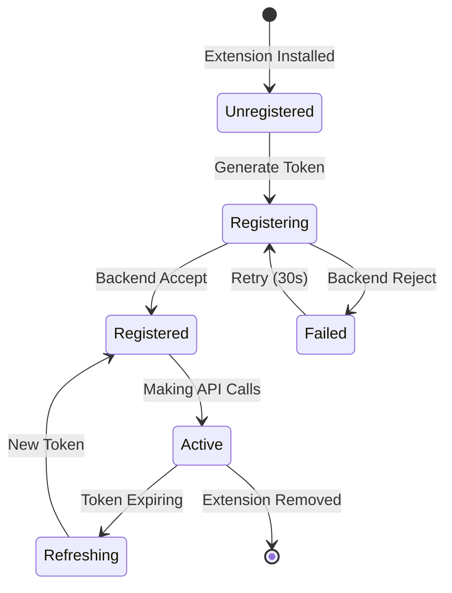

# Authentication Quick Reference

## 🚀 Quick Start

### For Developers

1. **Build & Deploy**
```bash
# Frontend - build extension
cd chrome-home-react
npm run build

# Backend - deploy to Cloud Run
cd weather-service
gcloud run deploy weather-service --source . --region us-central1 --allow-unauthenticated
```

2. **Test Authentication**
```bash
# Check if extension is registered
chrome.storage.local.get(['backend_registered'], console.log)

# Force token refresh
chrome.storage.local.clear()
```

## 🔑 Key Points

### Token Format
- **Structure**: `base64(payload).signature`
- **Payload**: `{ext, fp, ts, nonce}`
- **Signature**: `SHA256(tokenData + fingerprint)[:32]`
- **Expiry**: 24 hours

### Critical Timestamps
```javascript
// ✅ CORRECT - Use seconds
Math.floor(Date.now() / 1000)

// ❌ WRONG - Don't use milliseconds
Date.now()
```

### Required Headers
```javascript
{
  'X-Extension-Token': token,
  'X-Extension-ID': extensionId,
  'X-Extension-Version': version,
  'X-Extension-Fingerprint': fingerprint,
  'X-Request-ID': requestId
}
```

## 🐛 Troubleshooting

| Error | Cause | Fix |
|-------|-------|-----|
| 401 "Invalid token" | Signature mismatch | Use `generateStringHash()` not `generateFingerprint()` |
| 401 "Extension not registered" | No session | Ensure background.ts calls `/api/auth/register` |
| 401 "Token expired" | Token > 24 hours old | Token auto-refreshes, or call `refreshToken()` |
| CORS error | Headers blocked | Backend must allow custom headers in CORS |

## 📊 Auth Flow States



## 🔧 Debug Commands

```javascript
// View current token
chrome.storage.local.get('ext_auth_token', data => {
  const [payload] = data.ext_auth_token.split('.')
  console.log(JSON.parse(atob(payload)))
})

// Check registration status
chrome.storage.local.get(['backend_registered', 'registration_time'], console.log)

// View auth version
chrome.storage.local.get('auth_version', console.log)

// Force regeneration
chrome.storage.local.set({auth_version: 0})
```

## 📈 Metrics

- **Token Lifetime**: 24 hours
- **Refresh Interval**: 20 hours
- **Rate Limit**: 120 requests/minute
- **Session Cleanup**: 7 days inactive
- **Retry Delay**: 30 seconds

## 🔐 Security Checklist

- [x] Tokens expire after 24 hours
- [x] Signatures validated on every request
- [x] Rate limiting per extension
- [x] Session tracking and cleanup
- [x] Security event logging
- [x] CORS properly configured
- [x] Timestamps in seconds (not milliseconds)
- [x] Unique nonce per token

## 📁 File Locations

**Frontend:**
- `src/background.ts` - Token generation on install
- `src/services/auth.ts` - Auth service & API calls
- `src/widgets/GoogleWeatherWidget.jsx` - Authenticated requests

**Backend:**
- `auth.go` - Auth middleware & validation
- `main.go` - Protected endpoints
- `auth_test.go` - Test suite

## 🚨 Emergency Procedures

### Backend is rejecting all tokens
1. Check Cloud Run logs for specific errors
2. Verify CORS headers include all custom headers
3. Ensure timestamp format is seconds, not milliseconds
4. Check signature generation uses `generateStringHash()`

### Extension won't authenticate
1. Open chrome://extensions
2. Click "service worker" to see background console
3. Check for registration errors
4. Run `chrome.storage.local.clear()` to reset

### Rate limiting issues
1. Current limit: 120 req/min
2. Check with: `gcloud logging read ... | grep RATE_LIMIT`
3. Adjust in `auth.go`: `MAX_REQUEST_PER_MIN`

## 📞 Support

- **Logs**: `gcloud logging read "resource.type=cloud_run_revision"`
- **Storage**: Chrome DevTools > Application > Storage > Local Storage
- **Console**: Chrome DevTools > Console (F12)
- **Background**: chrome://extensions > Service Worker